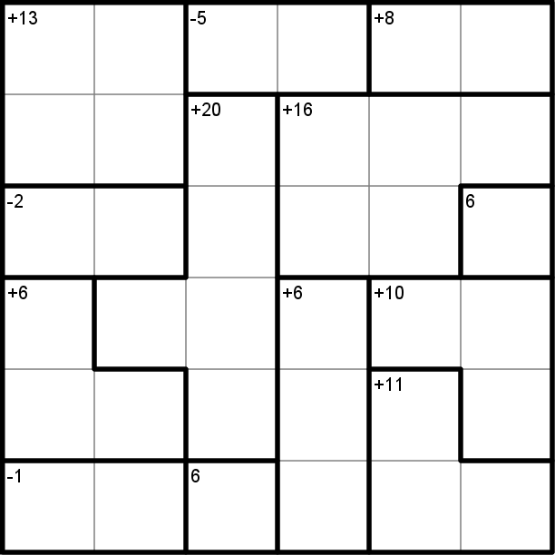
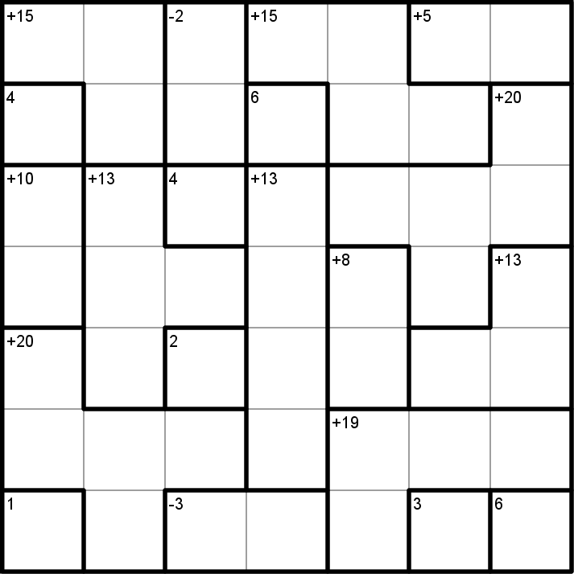
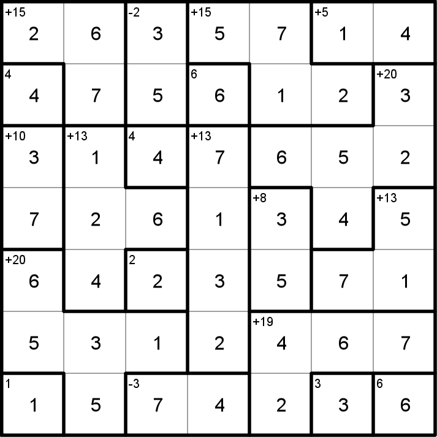
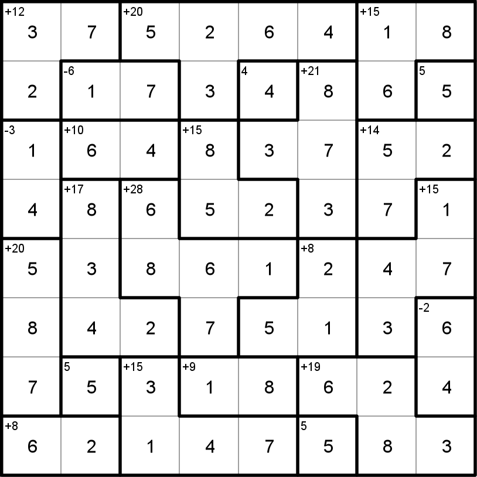

# KenKen
[KenKen](https://en.wikipedia.org/wiki/KenKen) are mathematical puzzles similar to [Sudoku](). 
They must include exactly one of each number in each column and row while also generating correct 
solutions to the math.

This library generates KenKen puzzles of any size and is capable of rendering them as images.

### 4x4
 

### 5x5
 

### 6x6
 

### 7x7
 

### 8x8
 
