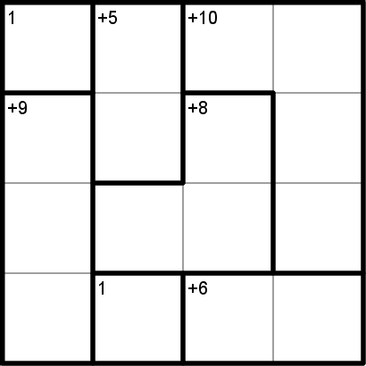
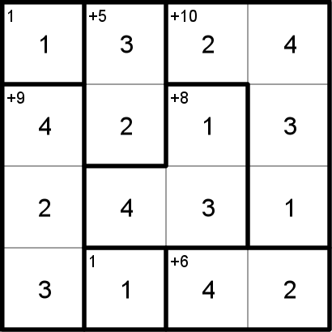
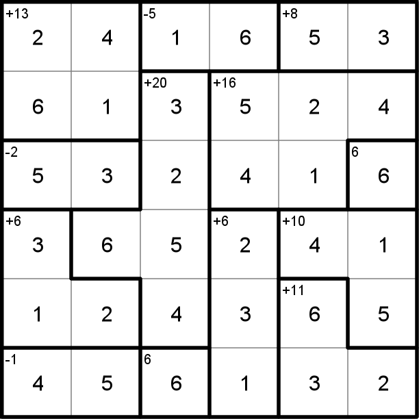
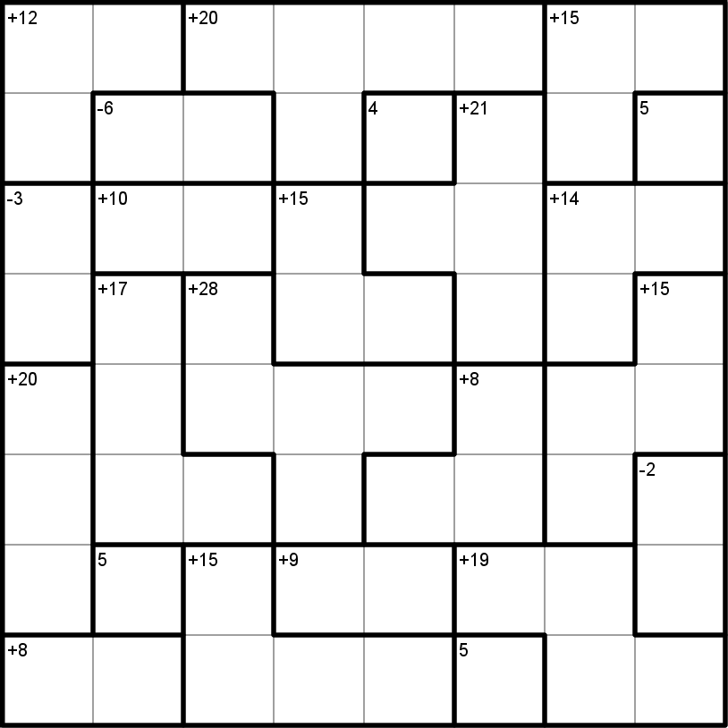
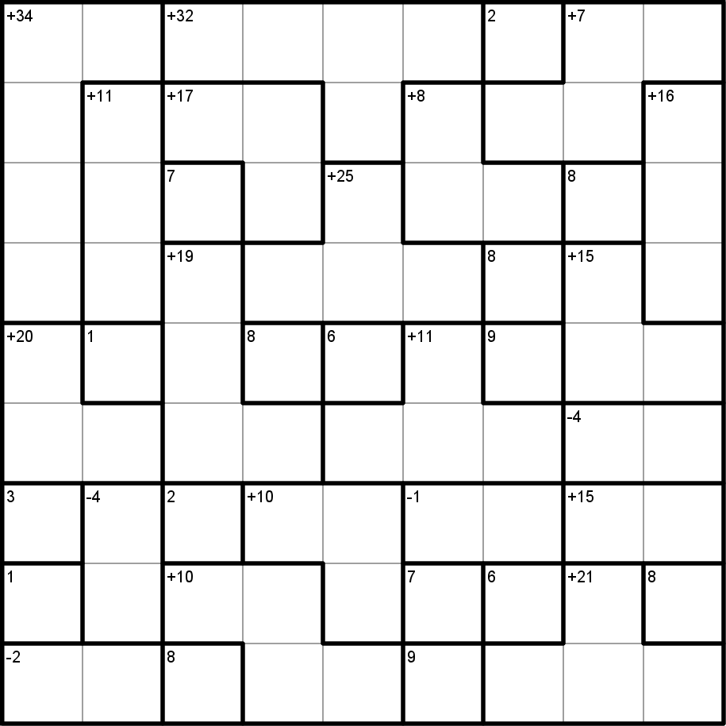
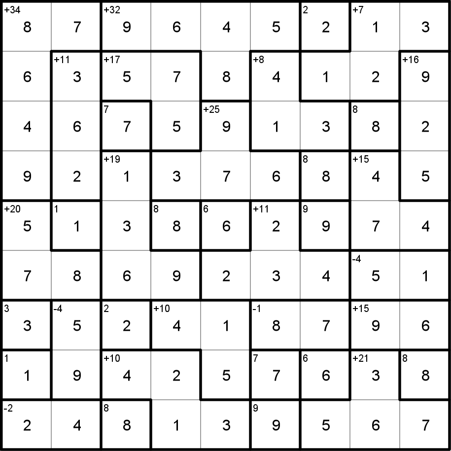
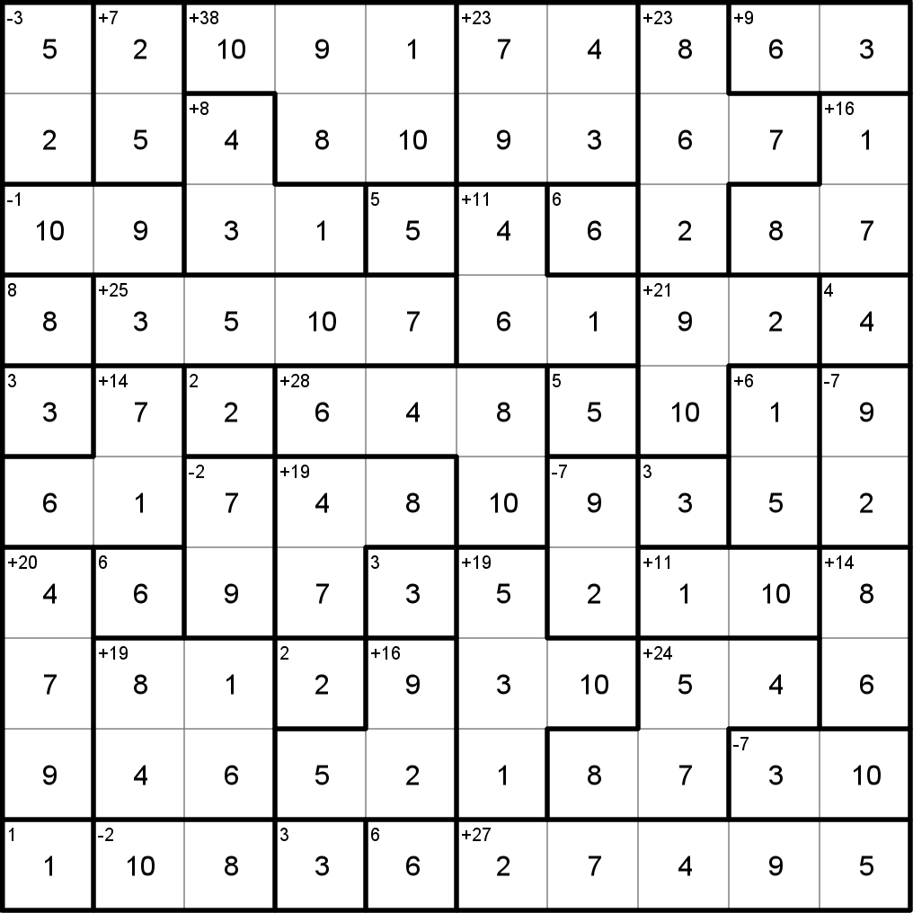

# KenKen
This is a library for generating and rendering KenKen puzzles. Puzzle generation is seedable and highly 
customizable. Rendering can also be customized.

[KenKen](https://en.wikipedia.org/wiki/KenKen) are mathematical puzzles similar to [Sudoku](). 
They must include exactly one of each number in each column and row while also solving the simple math
problems arranged throughout the board.

This library generates KenKen puzzles of any size and is capable of rendering them as images via an 
HTMLCanvasElement.

## Usage
#####  Generate a 4x4 KenKen puzzle.
```typescript
import { KenKenGenerator } from 'ken-ken'

const puz = KenKenGenerator.generate({ size: 4 })
```
   
##### Generate a 6x6 KenKen puzzle with a specific seed and more math operations

```typescript
import { KenKenGenerator, MathOperators } from 'ken-ken'

const puz = KenKenGenerator.generate({ 
  size: 6, 
  seed: 1069, 
  operations: [
    MathOperators.ADDITION, 
    MathOperators.SUBTRACTION, 
    MathOperators.MULTIPLICATION, 
    MathOperators.DIVISION] 
})
```

    
##### Render a 7x7 to a PNG
Uses the [node-canvas](https://www.npmjs.com/package/canvas) library.
```typescript
import { KenKenGenerator, Renderer } from 'ken-ken'
import { createCanvas } from 'canvas'
import * as fs from 'fs'

const puz = KenKenGenerator.generate({ size: 7 })
const canvas = createCanvas(100, 100)
Renderer.renderCanvas(puz, canvas.getContext('2d'), { withSolution: true })
const canvasBuffer = canvas.toBuffer()
fs.writeFileSync('kenken-7x7.png', canvasBuffer)
```

## Output

### 4x4
 
### 5x5
 
### 6x6
 
### 7x7
 
### 8x8
 
### 9x9
 
### 10x10
 

### TODO
- [ ] Allow more complex math constraints to be imposed
- [ ] Test the various types of math operations
- [ ] Generate cell and math distributions
- [ ] Add CLI interface
